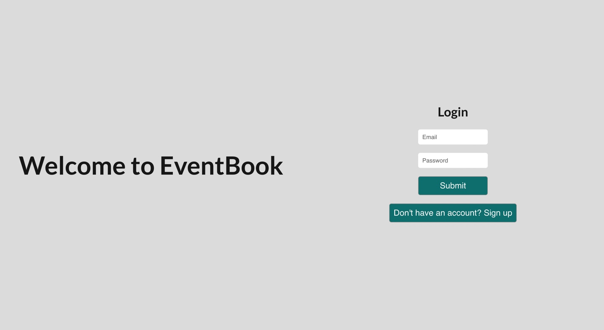

  <header align="center"> 
  <h1> 👓 EventBook 👓 </h1> 
  </header>

# User-Story

I want to create an event that I can invite all my friends to and we can discuss the plans and save the date.

# Table of contents

- [User-Story](#user-Story)
- [Description](#Description)
- [Screenshots](#Screenshots)
- [Installations](#installations)
- [Usage](#usage)
- [License](#license)
- [Contributing](#Contributing)
- [Testing-Procedure](#Testing-Procedure)
- [Contact](#contact)

# Description

    A Full Stack Web Application for event organisation, using the MERN stack architecture.

# Screenshots

# Installations

    npm i to install requirements.

Technologies used include but are not limited to:

- M-E-R-N
- Apollo
- JWT
- Bcrypt
- GQL

# Usage

Install dependencies then run npm/yarn develop in the command line to run locally.  
Otherwise visit my website: https://eventboook.herokuapp.com/ where the app is currently live and accessable to the public.

# Contributing

Create your own branch, make small changes then pull request for certified moderators or myself to review. Make sure PR is detailed with changes made.

# Testing-Procedure

    N/A

# Contact

If you would like to reach me in regards to either questions or comments, I am more than
happy to respond via github [Hayden-code](https://github.com/Hayden-code) or email [haychjones@gmail.com](haychjones@gmail.com).
